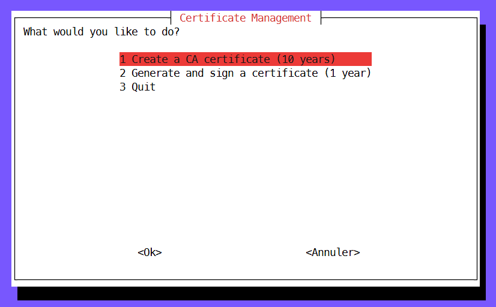

<p align="center">
  
</p>

`cert_manager.sh` is a Bash script designed to simplify the process of creating, managing, and signing SSL/TLS certificates. This script provides an easy way to generate a Certificate Authority (CA) certificate, create Certificate Signing Requests (CSR), and sign certificates using your CA.

## Features

- **Create a CA Certificate:** Generate a Certificate Authority (CA) certificate with a custom name. The CA certificate will be valid for 10 years.
- **Generate and Sign Certificates:** Automatically generate a Certificate Signing Request (CSR) and sign it using an existing CA certificate. The signed certificate will be valid for 1 year.
- **Error Handling:** The script includes robust error checking to prevent overwriting existing certificates or CSRs.

## Prerequisites

To use this script, you need:

- A Unix-like operating system (Linux, macOS, etc.).
- OpenSSL installed on your system (the `openssl` command should be available).

## Usage

1. **Download the script:**

   ```bash
   wget https://path_to_your_script/cert_manager.sh
   ```

   Or clone the repository:

   ```bash
   git clone https://github.com/jturazzi/certs-manager.git
   ```

2. **Make the script executable:**

   ```bash
   chmod +x cert_manager.sh
   ```

3. **Run the script:**

   ```bash
   ./cert_manager.sh
   ```

   You will be prompted to choose the action you want to perform via a menu.

### Menu Options

1. **Create a CA Certificate (10 years):**
   - Enter a directory name for storing the CA certificate and a custom name for the CA.
   - The script will generate a new CA certificate and save it in the specified directory.

2. **Generate and Sign a Certificate (1 year):**
   - Enter the CA directory name, the directory name for the CSR, a custom name for the CSR, and optionally, a list of domain names and IP addresses.
   - The script will generate a CSR, sign it using the specified CA, and create a new certificate in the indicated directory.

3. **Quit:**
   - Exit the script.

### Example

- **Creating a CA Certificate:**

   If you choose to create a CA certificate, you will be asked for:
   - Directory name (e.g., `myCA`)
   - Custom CA name (e.g., `MyCompanyCA`)

   The script will create a CA certificate in the `myCA` directory.

- **Generating and Signing a Certificate:**

   If you choose to generate and sign a certificate, you will need to provide:
   - CA directory name (e.g., `myCA`)
   - CSR directory name (e.g., `myCert`)
   - Custom CSR name (e.g., `MyWebsite`)
   - (Optional) Domain names (e.g., `example.com,www.example.com`)
   - (Optional) IP addresses (e.g., `192.168.1.1,192.168.1.2`)

   The script will generate a CSR and sign it, resulting in a new certificate in the `myCert` directory.

## Notes

- The script assumes that the directory structure will be organized, with separate directories for each CA and CSR.
- Ensure that the names provided do not conflict with existing directories or files to avoid errors.

## License

This project is licensed under the MIT License - see the [LICENSE](LICENSE) file for details.
